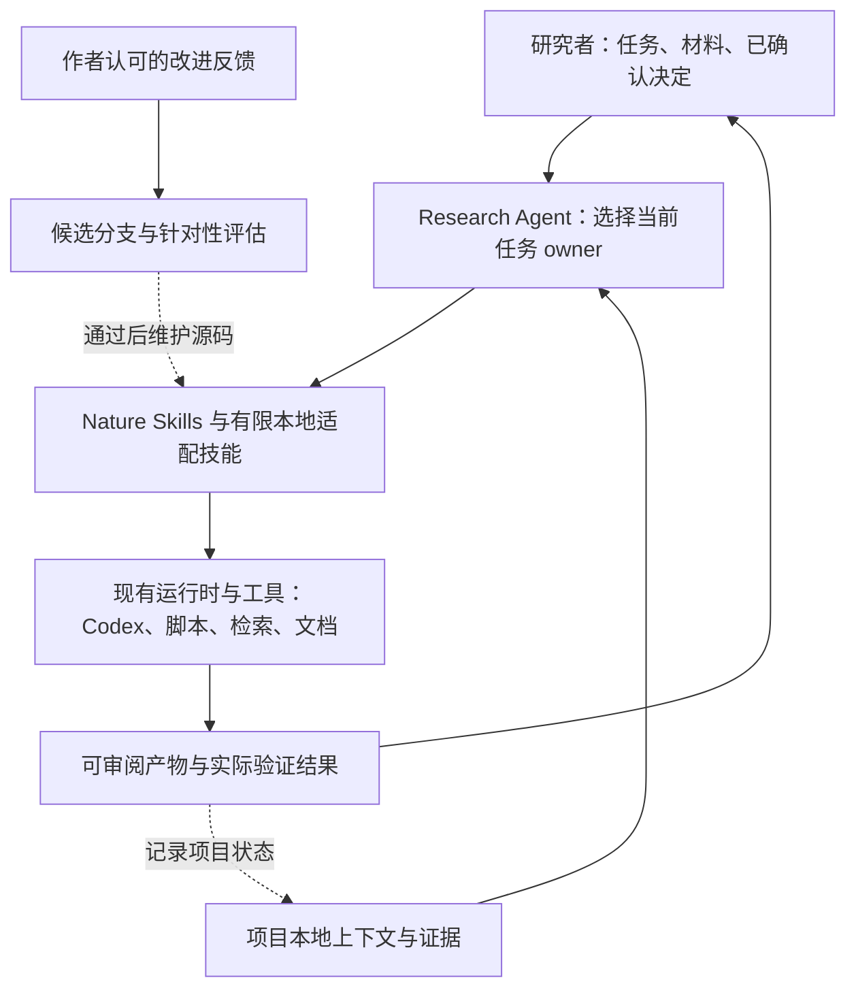

# 系统边界

## 研究者主导的协作

你提出当前任务、指定材料和约束。Research Agent 选择一个主要 owner，按需使用
检索、下载、证据审计、格式化等支持能力，在已授权范围内完成工作。
必要的工具调用无需逐步询问；研究问题、实质方法取舍、主张或受保护产物发生
变化时，才把有证据支撑的选项交给作者。

## 四类信息分别维护

| 信息 | 存放位置 | 用途 |
|---|---|---|
| 可复用技能与工具 | 本仓库 `skills/`、`scripts/` | Git 版本管理与改进 |
| 科研协作偏好 | 本文及相关 owner | 中文优先、证据边界、修订粒度 |
| 项目事实与已确认决定 | 研究项目已有 `.agent/` 或等效文件 | 跨会话恢复与当前证据定位 |
| 凭据、API 配置、论文库、未公开案例 | 运行环境与研究项目；本仓库外 | 按任务授权使用 |

现有 `.agent/NEXT.md`、`STATE.md` 足以承担恢复入口，不建立第二套项目记忆库。
长期稳定背景、已确认决策与短期工作状态分开；任何记忆都不能替代原文件证据。

## 当前明确保留的科研习惯

- 中文沟通优先，中文与英文论文均可处理；语言润色保持事实和主张强度。
- 从作者指定阶段开始；采用已认可的摘要、大纲和当前正式稿作为相应权威。
- 引用核对回到原文；检索命中和知识库片段只提供候选证据。
- 对科学对象、分析尺度、对照、指标和因果强度保持精确。
- 先完成可复核的具体工作；正式稿与修改说明分开交付。
- 真实失败驱动技能改进，既有规则执行失误不直接导致更多规则。
- 图形沿用现有 figure owner；数据正确性、可编辑性和渲染可读性分别验证。
- 作者保留科研判断。默认不启动多代理、阶段流水线、日程或自我修改。

## 首版能力边界

当前仓库已经覆盖技能源码版本管理、维护检查、参考设计分析和评估流程。
以下仍由原安装或项目提供：技能发现、模型/tool loop、权限、Word/PPT/Origin、
私有知识库及全文获取账户。`stage` 只复制到新目录供审阅，不安装、不激活。

这种分层允许今后更换运行时，但尚未实现跨运行时适配。只有现有运行时在真实
科研任务中出现可复现的缺口时，才考虑抽取新的执行组件。
